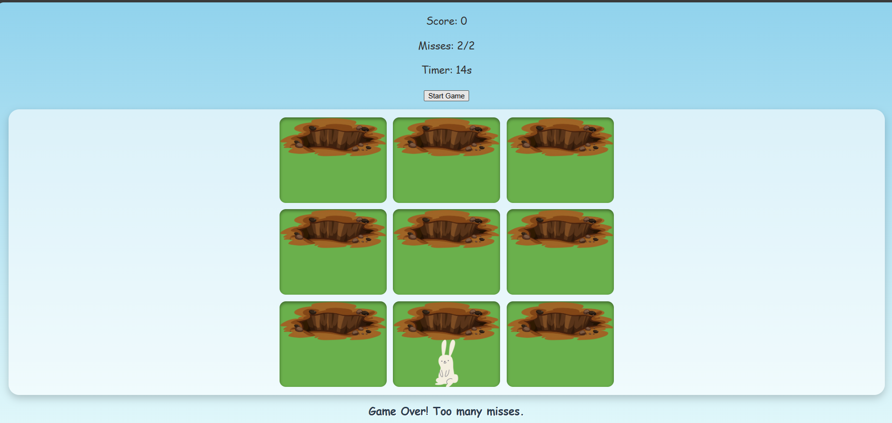

 Whack-a-Mole

Game SS:

Whack-a-Mole

- Bunnies randomly pop out of holes on the screen.

- The player needs to click on the bunnies to score points.

- The game runs for 15 seconds in total.

- If you miss 2 bunnies, the game ends early.

- If you score 10 points or more, you win.

I chose to build this project because I wanted something fun, interactive, and beginner-friendly that would help me practice JavaScript basics such as timers, event listeners, randomization, and DOM manipulation. I chose this game specifically as it reminds me of some of the childhood games.

Getting Started

Play the game here: [Deployed Game Link](https://husaindhaif.github.io/whack-a-mole/)

How to Play

- Press the "Start Game" button.

- Bunnies will appear randomly in different holes.

- Click the bunnies as fast as you can to earn points.

- The game ends after 15 seconds or if you miss 2 bunnies.

Attributions

Bunny image :
Hole image :

MDN : https://developer.mozilla.org/en-US/docs/Web/API/Canvas_API/Tutorial/Basic_animations
https://www.youtube.com/watch?v=z2LQYsZhsFw

Technologies Used

HTML for structure

CSS for styling and layout

JavaScript for all game logic and interactivity

Prettierrc to keep the code neat and arranged

Next Steps

- Some improvements I plan to add in the future:
- Add sound effects when a bunny is clicked or missed
- Make the game more responsive on mobile devices
- Add difficulty levels where bunnies appear and disappear faster
- Introduce new characters or themes
- Keep track of high scores using localStorage